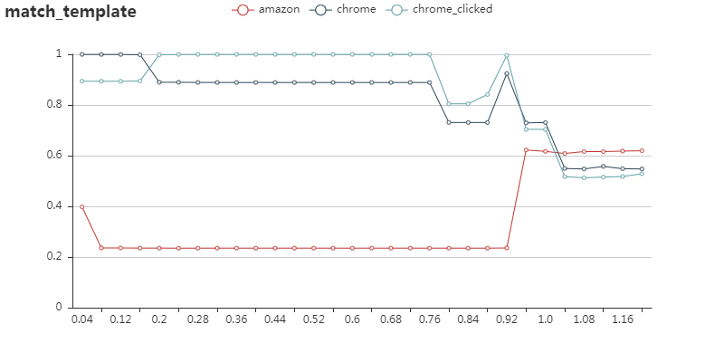

# stagesep2

Analyse, and convert video into useful data.

# 原理

stagesep2 的两个核心功能：

- ocr（tesseract）
- 图像识别（opencv）

视频是由一系列连续的图片（帧）组成的，通过逐帧分析，我们能够从视频中提取出流程相关信息。理论上，每一帧都存在能够区分它与其他帧的标识，可能是文字或图像。

例如，我们需要测试 从桌面启动chrome，打开amazon 的速度：

- 在操作前，我们在主页。主页上会有特定的文字与图像（例如chrome icon）
- 在操作时，页面会有特定的变化（例如chrome icon变暗，或出现点击位置反馈）
- 在操作后（chrome启动后），页面发生切换，页面上的文字与图像都会发生改变（例如amazon logo出现）

通过对这些阶段进行分析，得到每个阶段及帧对应的时间戳，我们就能够准确地计算出耗时。

# 目的

适用于全平台的性能测试方案。

## 为什么介入图像识别

### UI

现阶段的UI测试大多属于纯代码层面的行为，而对于控件是否真的渲染成为我们希望的样子我们并不知晓。

### 性能

在常规速度类性能测试中通常通过提前埋点进行测试，一般会有两个问题：

- 具有侵入性（需要改动源码）
- 对于界面相关的场景不适用（并不知道界面是否已经被真正渲染出来）

## 图像识别在测试中的应用

一般来说，通过图像识别来进行测试分为三个步骤：

- 图像/视频 采集
    - 这个部分通常由高速摄像机或稳定帧率的外置相机进行拍摄，得到固定帧率的视频
    - 软件录制是不靠谱的，很容易出现帧率不稳定的情况。而如果时间与帧数不能精确对应的话数据会失真

- 视频处理
    - 提取视频中的信息，输出成为我们需要的形式
    - 也是整个流程最关键的部分

- 数据分析
    - 将视频处理的结果进行分析，得到结论或生成报告

该项目将承载视频处理的部分，将录制好的视频解析成开发者需要的格式。

# 使用

从 [官方示例](https://github.com/williamfzc/stagesep2-sample) 开始。

# 相关内容

## 依赖

- [opencv](https://opencv-python-tutroals.readthedocs.io/en/latest/py_tutorials/py_tutorials.html): 图像与视频处理
- [tesseract-ocr](https://github.com/tesseract-ocr/tesseract/wiki/Downloads): 文本检测
- [skimage](https://github.com/scikit-image/scikit-image): 主要用于图片相似度比较
- [jieba](https://github.com/fxsjy/jieba)：ocr结果的进一步处理

## 旧版本

- [stagesep](https://github.com/williamfzc/stagesep)
- [利用图像识别与 OCR 进行速度类测试](https://testerhome.com/topics/16063)

# 协议

MIT
